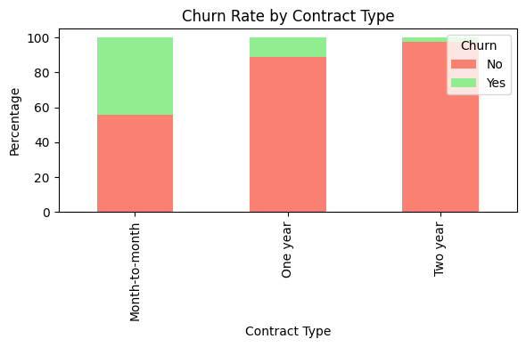
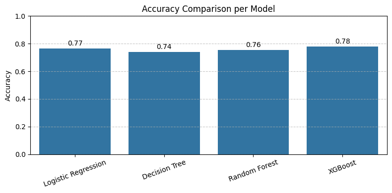

# 📡 Telco Customer Churn Prediction


This repository contains an **end-to-end data science project** focused on predicting customer churn for a telecommunications company. The goal is to leverage customer data to identify key drivers of churn and build a robust machine learning model that predicts customers who are most at risk—allowing for proactive and targeted retention strategies.

---

## ✨ Project Highlights

* **Comprehensive EDA:** Deep exploratory data analysis to uncover patterns in customer behavior and identify key features correlated with churn.
* **Advanced Modeling:** Trained and evaluated four different classification models (Logistic Regression, Decision Tree, Random Forest, and XGBoost).
* **Automated Hyperparameter Tuning:** Leveraged **Optuna** for efficient and automated hyperparameter optimization, using **AUC-ROC** as the target metric.
* **Class Imbalance Handling:** Implemented **SMOTE** within a Scikit-learn pipeline to address class imbalance without causing data leakage.
* **SQL-Based Data Preparation:** The initial data ingestion, normalization, and aggregation were performed in **MySQL**, showcasing database and SQL skills.

---

## 📊 Key Findings & Visualizations

### Top Churn Drivers
The analysis confirmed that the most significant predictors of customer churn are:
1.  **Contract Type:** Customers on **Month-to-Month** contracts have a significantly higher churn rate.
2.  **Internet Service:** Customers with **Fiber Optic** service are more likely to churn.
3.  **Tenure:** New customers with **low tenure** are at a much higher risk of leaving.



---

### Model Performance
The **XGBoost Classifier**, tuned with Optuna, was the best-performing model.

* **Test Accuracy:** 78%
* **Recall (Churn Class):** 71%
* **AUC-ROC:** 0.84

The model's ability to correctly identify 71% of actual churners is crucial for effective retention campaigns.




---

## 💡 Actionable Business Recommendations

Based on the model's findings, the following retention strategies are recommended:

1.  **Incentivize Long-Term Contracts:** Proactively offer discounts or loyalty perks to high-risk Month-to-Month customers to encourage them to switch to One- or Two-Year contracts.
2.  **Review Fiber Optic Service:** Investigate potential issues with the Fiber Optic service (e.g., pricing, reliability, support) as it is a major churn driver despite being a premium service.
3.  **Onboarding Programs for New Customers:** Implement enhanced onboarding and support programs for customers in their first few months to improve their initial experience and reduce early churn.

---

## 🛠️ Tech Stack

| Component              | Technology / Library                                 |
| ---------------------- | ---------------------------------------------------- |
| **Data Preparation** | MySQL                                                |
| **Data Analysis** | Python, Pandas, NumPy                                |
| **Visualization** | Matplotlib, Seaborn                                  |
| **Modeling & Tuning** | Scikit-learn, XGBoost, Optuna, SMOTE (imblearn)      |
| **Project Management** | Git, GitHub, Jupyter Notebook, Virtual Environments  |

---

## 🚀 Setup and Installation

### 1. Running the Analysis (Jupyter Notebook)

The notebook is self-contained and can be run using the provided CSV file.

1.  Clone the repository:
    ```bash
    git clone [https://github.com/your-username/telco-churn-prediction.git](https://github.com/your-username/telco-churn-prediction.git)
    ```
2.  Create and activate a Python virtual environment.
    > This project was developed and tested using **Python 3.12.10**.
    ```bash
    # Create the environment
    python -m venv venv
    # Activate it (Windows)
    .\venv\Scripts\activate
    ```
3.  Install the required packages:
    ```bash
    pip install -r requirements.txt
    ```
4.  You can now run the Jupyter Notebook located at `/notebooks/1.0-telco-churn-eda-and-modeling.ipynb`.

### 2. Reproducing the Database (Optional)

This step is not required to run the analysis notebook. It is for users who wish to reproduce the initial database setup.

1.  Ensure you have a local **MySQL** server running.
2.  Download the raw dataset from [Kaggle](https://www.kaggle.com/blastchar/telco-customer-churn) and place it where MySQL can access it.
3.  Run the SQL scripts in the `/sql` directory in the following order:
    1.  `1_create_database_and_table.sql`
    2.  `2_insert_data.sql`
    3.  `3_initial_data_profiling.sql`
    4.  `4_data_aggregation_and_relationship_analysis.sql`
    5.  `5_final_data_extraction.sql`
    > ⚠️ You will need to edit the file path inside `2_insert_data.sql` to point to your local CSV file (WA_Fn-UseC_-Telco-Customer-Churn.csv; can be found on data/raw_data).

---

## 📝 License

This project is licensed under the MIT License. See the `LICENSE` file for details.

---

## 📬 Contact

* **Daffa Kaisha Pratama Chandra** - [daffakpc21@gmail.com](mailto:daffakpc21@gmail.com)
* **LinkedIn:** [https://www.linkedin.com/in/daffakaisha/](https://www.linkedin.com/in/daffakaisha/)